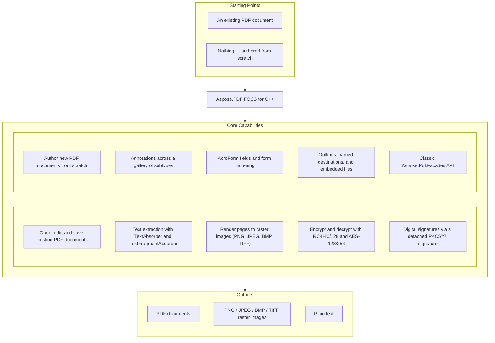

# Aspose.PDF FOSS for C++

[](https://github.com/aspose-pdf-foss/Aspose.PDF-FOSS-for-Cpp/actions/workflows/ci.yml) [](https://opensource.org/licenses/MIT) [](https://en.cppreference.com/w/cpp/20) [](https://cmake.org/)

[](https://products.aspose.org/pdf/cpp/)

Aspose.PDF FOSS for C++ is a free, open-source, modern C++20 library for working with PDF
documents — opening and saving existing files, extracting text, rasterising pages to image
formats, and building documents from scratch (text, tables, vector graphics, watermarks,
annotations, AcroForm fields, and bookmarks). It links against nothing but the C++ standard
library: every primitive, including the TIFF, JPEG, and PNG codecs and the page rasteriser, is
implemented from scratch with no dependency on any commercial PDF stack. Its public API is a
strict subset of the commercial Aspose.PDF for .NET library — class names, method names, and
shapes mirror it where natural for migrants — and spec references throughout follow ISO 32000-1
(PDF 1.7) and ISO 32000-2 (PDF 2.0).

## Navigation

- [At a Glance](#at-a-glance)
- [Key Capabilities](#key-capabilities)
- [Installation](#installation)
- [Dependencies](#dependencies)
- [Quick Start](#quick-start)
- [Additional Examples](#additional-examples)
- [Project Structure](#project-structure)
- [API Reference](#api-reference)
- [Documentation & Resources](#documentation--resources)
- [Scope and Limitations](#scope-and-limitations)
- [Development and Testing](#development-and-testing)
- [Third-Party Notices](#third-party-notices)
- [License](#license)

## At a Glance



## Key Capabilities

- Open, edit, and save existing PDF documents with `Document`, including byte-verbatim
  round-trips or an incremental `/Info`-metadata update that preserves the original bytes; open
  password-protected files by supplying the user or owner password to `Document(path, password)`,
  with `IsEncrypted()` reporting the state.
- Extract text with `Text::TextAbsorber`, which walks a whole `Document` or a single `Page`, or
  `Text::TextFragmentAbsorber` for positioned fragments with font, size, and colour.
- Render pages to raster images through `PngDevice`, `JpegDevice`, and `BmpDevice` (single page
  per call), or `TiffDevice` (single page, or a full multi-page document range in one call via
  `Process(Document, startPage, endPage, ostream)`) — an anti-aliased renderer with no third-party
  runtime dependency;
  `TiffDevice` supports 1/4/8/24-bpp output with median-cut palette quantisation, or a
  caller-supplied `IIndexBitmapConverter` (`Get1BppImage`/`Get4BppImage`/`Get8BppImage`) for
  caller-controlled palette generation.
- Encrypt and decrypt with `Document::Encrypt(user, owner, permissions, algorithm)` — RC4-40,
  RC4-128, AES-128, or AES-256 (PDF 2.0, R=6) — governed by a granular `Permissions` flags enum
  (print, modify, extract, annotate, fill form, accessibility, assemble, high-res print).
- Sign documents with `Facades::PdfFileSignature`, which adds a detached PKCS#7
  (`adbe.pkcs7.detached`) signature with a byte-exact `/ByteRange`.
- Build documents from scratch: positioned and word-wrapped text through `Text::TextBuilder`,
  `TextFragment`, and `TextParagraph` (with font lookup via `FontRepository::FindFont`), tabular
  layout through `Table`/`Row`/`Cell` (column widths, per-cell and default borders, background
  colours, and column-spanning cells), vector shapes through `Drawing::Graph` (`Line`, `Rectangle`,
  `Circle`, `Ellipse`), and rotated, semi-transparent text overlays through `WatermarkArtifact`.
- References to the Standard-14 fonts (`/Helvetica`, `/Times-Roman`, `/Courier`, four styles
  each) without an embedded `/FontFile` paint correctly via system fonts, falling back to bundled
  Liberation substitutes (SIL OFL 1.1) so glyphs render even in fontless Linux/CI containers; text
  extracted through `TextDevice` goes through a pluggable `Encoding` — a BCL
  `System.Text.Encoding`-style charset codec supporting UTF-8, UTF-16LE, UTF-16BE, Latin-1, and
  Windows-1252 output.
- Add and manage annotations across a gallery of subtypes — `Highlight`, `Underline`, `Squiggly`,
  `StrikeOut`, `Square`, `Circle`, `Line`, `Ink`, `Text` (sticky note), `FreeText`, `Stamp`, `Link`
  (with `GoToAction`/`GoToURIAction`), and `FileAttachment` — each with a pre-generated `/AP`
  appearance stream so it renders in any spec-conforming viewer.
- Add interactive AcroForm fields — `TextBoxField`, `CheckboxField`, `RadioButtonField`,
  `ComboBoxField`, `ListBoxField`, and push-button `ButtonField` — through the `Form` class
  (`Document::Form()`), and flatten every field into static page content with `Form::Flatten()`.
- Define a hierarchical outline (bookmark) tree with `OutlineItemCollection`, bold/italic styling,
  and `XYZExplicitDestination` targets; define reusable `NamedDestination`s; and attach
  document-level companion files via `Document::EmbeddedFiles()`.
- Read and write document metadata through typed `DocumentInfo` accessors (title, author,
  subject, keywords, creator, producer, dates) plus `Add`/`Remove`/`ClearCustomData` for
  arbitrary entries, and read XMP metadata via `Metadata`.
- Use the classic `Aspose::Pdf::Facades` API — `PdfConverter` (rasterise a PDF to multi-page TIFF
  or per-page PNG), `PdfExtractor` (text extraction honouring `StartPage`/`EndPage`),
  `PdfFileSecurity` (encrypt/decrypt/change passwords), `PdfFileSignature` (sign),
  `PdfBookmarkEditor` (create/extract bookmarks), `PdfFileEditor` (concatenate and split
  documents via `Concatenate`/`SplitFromFirst`/`SplitToEnd`/`SplitToPages`), and `PdfFileStamp`
  (page header/footer/page-number stamping via `AddHeader`/`AddFooter`/`AddPageNumber`) — each
  binding independently to a `Document`.

## Installation

This library builds as a static library you link into your project. Add it as a subdirectory of
your CMake build:

```cmake
add_subdirectory(aspose.pdf-foss-for-cpp)
target_link_libraries(your_app PRIVATE aspose_pdf_foss)
```

### Requirements

- A C++20 compiler (clang 16+, gcc 13+, or MSVC 2022 17.5+)
- CMake 3.20 or later
- Python 3, build-time only — a generator step embeds the bundled font outlines into a generated
  source file

**Runtime dependencies: none.** The test suite alone fetches
[GoogleTest](https://github.com/google/googletest) v1.14.0 via CMake `FetchContent` at configure
time; it is not needed to build or consume the library itself.

### Build From Source

```bash
cmake -S . -B build
cmake --build build
```

The static library lands at `build/libaspose_pdf_foss.a` (or `aspose_pdf_foss.lib` on MSVC), built
out-of-source under `build/`. For a release build, pass `-DCMAKE_BUILD_TYPE=Release` to the
configure step. `CMakePresets.json` also carries host-conditional Windows-MSVC presets — e.g.
`cmake --preset windows-msvc-debug`.

## Dependencies

### Required Package Dependencies

- `Python3` — required by the CMake configure step
  (`find_package(Python3 REQUIRED COMPONENTS Interpreter)` in `CMakeLists.txt`) to run a
  generator script that embeds the bundled Standard-14 font outlines into a generated source
  file; needed only to configure/build the library, not by the compiled library at runtime.

### Development Dependencies

- `googletest` (1.14.0) — fetched via CMake FetchContent in `CMakeLists.txt`; builds the
  `aspose_pdf_foss_tests` ctest binary only, never linked into the shipped `aspose_pdf_foss`
  library.

## Quick Start

Open a PDF, count its pages, extract text, and render page 1 to PNG at 150 DPI:

```cpp
#include <aspose/pdf/document.hpp>
#include <aspose/pdf/page_collection.hpp>
#include <aspose/pdf/text_absorber.hpp>
#include <aspose/pdf/png_device.hpp>
#include <aspose/pdf/resolution.hpp>
#include <fstream>
#include <iostream>

int main() {
    Aspose::Pdf::Document doc("input.pdf");
    std::cout << "Pages: " << doc.Pages().Count() << "\n";

    Aspose::Pdf::Text::TextAbsorber absorber;
    absorber.Visit(doc);
    std::cout << absorber.Text() << "\n";

    Aspose::Pdf::Devices::PngDevice png(Aspose::Pdf::Devices::Resolution(150));
    std::ofstream out("page1.png", std::ios::binary);
    png.Process(doc.Pages()[1], out);
}
```

Additional Examples below extends this into a from-scratch showcase
([`examples/12_create_features.cpp`](examples/12_create_features.cpp), one of the 12 programs
under `examples/` — see `examples/README.md`, built via `cmake --build build` into
`build/examples/<name>`): `Table`/`Row`/`Cell` layouts, `Drawing::Graph`
shapes (`Line`, `Rectangle`, `Circle`, `Ellipse`), annotations and AcroForm fields with a
pre-generated `/AP` appearance stream, `Form::Flatten()`-ready fields (`TextBoxField`,
`CheckboxField`, `RadioButtonField`, `ComboBoxField`, `ListBoxField`, `ButtonField`), an outline
(bookmark) tree, `CryptoAlgorithm`-based encryption (`RC4x40`/`RC4x128`/`AESx128`/`AESx256`) with
a `[Flags]` `Permissions` enum (not a DRM mechanism), a digital-signature walkthrough (see
`tests/facades_pdf_file_signature_smoke_test.cpp`), the `/Info`-metadata gotcha for from-scratch
documents, and the by-reference lifetime rule for `Paragraphs`/`Annotations`/`Form`/`Artifacts`/
`Outlines` — each parked in a `shared_ptr` until `Save()`.

## Additional Examples

12 runnable examples live in [`examples/`](examples/), covering the whole public surface —
opening documents, metadata, text extraction, save round-trips, every raster device, and a
from-scratch content-creation showcase. After `cmake --build build`, executables land at
`build/examples/<name>`; run them in numeric order, since each builds on the previous (see
[`examples/README.md`](examples/README.md) for the full tour).

The most illustrative beyond Quick Start is `12_create_features`, a 10-page showcase exercising
the whole creation surface — positioned text, a table, vector graphics, and a watermark, built
onto a page from an empty `Document`:

```cpp
#include <aspose/pdf/document.hpp>
#include <aspose/pdf/page_collection.hpp>
#include <aspose/pdf/text_builder.hpp>
#include <aspose/pdf/text_fragment.hpp>
#include <aspose/pdf/font_repository.hpp>
#include <aspose/pdf/position.hpp>
#include <aspose/pdf/table.hpp>
#include <aspose/pdf/border_info.hpp>
#include <aspose/pdf/drawing/graph.hpp>
#include <aspose/pdf/drawing/circle.hpp>
#include <aspose/pdf/watermark_artifact.hpp>

namespace pdf = Aspose::Pdf;
namespace txt = Aspose::Pdf::Text;
namespace draw = Aspose::Pdf::Drawing;

pdf::Document doc;
pdf::Page& page = doc.Pages().Add();
page.SetPageSize(595.0, 842.0);

// Positioned text
txt::TextFragment frag("Hello from Aspose.PDF FOSS for C++");
frag.TextState().Font(txt::FontRepository::FindFont("Helvetica"));
frag.TextState().FontSize(18.0f);
frag.Position(txt::Position(60.0, 760.0));
txt::TextBuilder{page}.AppendText(frag);

// Table — keep alive until doc.Save()
pdf::Table table;
table.ColumnWidths("250 120 120");
table.Border(pdf::BorderInfo(pdf::BorderSide::All, 0.5f));
pdf::Row& header = table.Rows().Add();
header.Cells().Add("Item"); header.Cells().Add("Qty"); header.Cells().Add("Price");
page.Paragraphs().Add(table);

// Vector graphics — keep alive until doc.Save()
draw::Graph g(495.0, 420.0);
g.Left(40.0); g.Top(40.0);
g.Shapes().push_back(std::make_unique<draw::Circle>(180.0f, 500.0f, 70.0f));
page.Paragraphs().Add(g);

// Watermark
pdf::WatermarkArtifact watermark;
page.Artifacts().Add(watermark);

doc.Save("scratch.pdf");
```

> **Lifetime rule for creation.** `Paragraphs`, `Annotations`, `Form`, `Artifacts`, and `Outlines`
> store the object added to them **by reference**, so every table, graph, annotation, field,
> watermark, and outline item must outlive `Save()`.

<details>
<summary>View Additional Examples</summary>

| Example | Shows |
|---|---|
| `01_pages` | open a PDF, count pages, iterate the 1-based indexer |
| `02_read_metadata` / `03_write_metadata` | read `DocumentInfo`; edit + incremental-update save |
| `04_text_extraction` | `TextAbsorber::Visit(Document)` |
| `05_save_roundtrip` | byte-verbatim save |
| `06_devices_surface` | construct + round-trip device properties |
| `07_render_png` | end-to-end `PngDevice::Process(Page, ostream)` |
| `08_render_tiff` | multi-page TIFF via `TiffDevice::Process(Document, …)` |
| `09_indexed_tiff` | 8-bpp palettised TIFF (median-cut) |
| `10_render_text_pdf` | render a page with an embedded TrueType font |
| `11_render_standard14` | render `/Helvetica` with no embedded font (fallback path) |
| `12_create_features` | from-scratch 10-page showcase: text, image, tables, graphics, annotations, AcroForm fields, bookmarks |

### Open a Password-Protected Document

```cpp
#include <aspose/pdf/document.hpp>

// Encrypted files: pass the user or owner password
Aspose::Pdf::Document locked("locked.pdf", "secret");
if (locked.IsEncrypted()) {
    // proceed to read pages, extract text, etc.
}
```

### Read and Update Document Metadata

Read existing `/Info` entries and update the document title through `DocumentInfo`:

```cpp
#include <aspose/pdf/document.hpp>
#include <aspose/pdf/document_info.hpp>
#include <iostream>

int main() {
    Aspose::Pdf::Document doc("input.pdf");
    auto& info = doc.Info();
    std::cout << "Title: " << info.Title() << "\n";
    std::cout << "Author: " << info.Author() << "\n";

    doc.SetTitle("Updated Report Title");
    doc.Save("output.pdf");
}
```

> The incremental-update writer patches an existing `/Info` object; a from-scratch document has
> no `/Info` to patch, so setting metadata on one and saving throws.

### Render Every Page to a Multi-Page TIFF

```cpp
#include <aspose/pdf/document.hpp>
#include <aspose/pdf/tiff_device.hpp>
#include <aspose/pdf/tiff_settings.hpp>
#include <aspose/pdf/color_depth.hpp>
#include <aspose/pdf/resolution.hpp>
#include <fstream>

Aspose::Pdf::Document doc("input.pdf");

// Every page -> one multi-page TIFF
Aspose::Pdf::Devices::TiffDevice tiff(Aspose::Pdf::Devices::Resolution(150));
std::ofstream tiffOut("all_pages.tiff", std::ios::binary);
tiff.Process(doc, 1, static_cast<int>(doc.Pages().Count()), tiffOut);

// 8-bpp palettised TIFF (median-cut palette)
Aspose::Pdf::Devices::TiffSettings settings;
settings.Depth(Aspose::Pdf::Devices::ColorDepth::Format8bpp);
Aspose::Pdf::Devices::TiffDevice indexed(Aspose::Pdf::Devices::Resolution(150), settings);
```

### Encrypt a Document With AES-256

```cpp
#include <aspose/pdf/document.hpp>

int main() {
    Aspose::Pdf::Document doc("input.pdf");
    doc.Encrypt("user-password", "owner-password",
                Aspose::Pdf::Permissions(),
                Aspose::Pdf::CryptoAlgorithm::AESx256);
    doc.Save("encrypted.pdf");
}
```

`CryptoAlgorithm` covers `RC4x40`, `RC4x128`, `AESx128`, and `AESx256`. `Permissions` is a
`[Flags]` enum (ISO 32000-1 §7.6.3.2 Table 22) — compose with `|`. Permissions are enforced by
viewers; the library itself is not a DRM mechanism.

### Sign a Document

```cpp
#include <aspose/pdf/facades/pdf_file_signature.hpp>

Aspose::Pdf::Facades::PdfFileSignature sig{"input.pdf", "signed.pdf"};
// configure the signature (certificate + key), then sign and save — a detached PKCS#7
// (adbe.pkcs7.detached) signature with a byte-exact /ByteRange. Output verifies under the
// OpenSSL CLI. See tests/facades_pdf_file_signature_smoke_test.cpp for the full signing flow.
```

See [`tests/facades_pdf_file_signature_smoke_test.cpp`](tests/facades_pdf_file_signature_smoke_test.cpp)
for the full signing flow.

### Add an Annotation

```cpp
#include <aspose/pdf/annotations/highlight_annotation.hpp>

namespace ann = Aspose::Pdf::Annotations;
ann::HighlightAnnotation a(page, pdf::Rectangle(60, 700, 210, 716, true));  // keep alive until Save()
a.Color(pdf::Color::FromRgb(1.0, 0.95, 0.0));
a.Contents("Highlight");
page.Annotations().Add(a);
```

Available subtypes: `Highlight`, `Underline`, `Squiggly`, `StrikeOut`, `Square`, `Circle`, `Line`,
`Ink`, `Text`, `FreeText`, `Stamp`, `Link` (with `GoToAction`/`GoToURIAction`), `FileAttachment`.

### Build an AcroForm Field

```cpp
#include <aspose/pdf/forms/text_box_field.hpp>

namespace frm = Aspose::Pdf::Forms;
frm::TextBoxField name(doc, pdf::Rectangle(190, 700, 470, 720, true));  // keep alive until Save()
name.PartialName("fullName");
name.Value("Alice Sample");
doc.Form().Add(name, /*pageNumber=*/1);
// doc.Form().Flatten();   // bake every field into static page content
```

Field types: `TextBoxField`, `CheckboxField`, `RadioButtonField`, `ComboBoxField`, `ListBoxField`,
`ButtonField`.

### Build an Outline (Bookmark) Tree

```cpp
#include <aspose/pdf/outline_collection.hpp>
#include <aspose/pdf/outline_item_collection.hpp>
#include <aspose/pdf/annotations/xyz_explicit_destination.hpp>

auto& root = doc.Outlines();
pdf::OutlineItemCollection item(root);               // keep alive until Save()
item.Title("Chapter 1");
item.Bold(true);
item.Destination(ann::XYZExplicitDestination(page, 0.0, 842.0, 0.0));
root.Add(item);
```

### Use a Facade (PdfConverter / PdfExtractor)

```cpp
#include <aspose/pdf/facades/pdf_converter.hpp>
#include <aspose/pdf/facades/pdf_extractor.hpp>

namespace facades = Aspose::Pdf::Facades;

// Rasterise every page to a multi-page TIFF via the real Devices::TiffDevice pipeline
facades::PdfConverter converter;
converter.BindPdf("input.pdf");
converter.SaveAsTIFF("output.tiff");

// Extract text honouring a StartPage/EndPage range, via the foundation TextAbsorber
facades::PdfExtractor extractor;
extractor.BindPdf("input.pdf");
extractor.StartPage(1);
extractor.EndPage(1);
extractor.ExtractText();
extractor.GetText("page1.txt");
```

`PdfConverter` also exposes a per-page cursor — `HasNextImage()`/`GetNextImage(outputFile)` — for
walking pages one at a time as PNGs via `Devices::PngDevice`, and `PageCount()` for the real page
count.

</details>

## Project Structure

Public-facing headers and their implementations sit under `include/aspose/pdf/` and `src/public/`;
internal foundation primitives (codecs, the rasteriser, crypto) live separately under
`include/internal/` and `src/internal/`:

```
├── include/
│   ├── aspose/pdf/            # Public-API headers (consumer-facing)
│   └── internal/              # Foundation primitive headers
├── src/
│   ├── public/                # Public-API implementation
│   └── internal/              # Foundation primitives (codecs, renderer, crypto)
├── tests/                     # GoogleTest unit + smoke tests
├── examples/                  # 12 runnable demo programs
├── pdfs/                      # Tiny sample PDFs for the examples
└── CMakeLists.txt
```

## API Reference

Aspose.PDF FOSS for C++ exposes 244 public types across 5 modules — Core API, Annotations,
Drawing, Facades, and Forms — listed in the table below; curated member detail for the
most-used entry points follows below it.

<details>
<summary>View the Public API Surface</summary>

### Core API

| Class | Description |
|---|---|
| `Artifact` | Class with 14 methods. |
| `ArtifactCollection` | Class with 7 methods and 1 property. |
| `BaseParagraph` | Class with 23 methods and 1 property. |
| `BitmapInfo` | BitmapInfo enables creation of raw bitmap images with specified pixel format, width, height, and pixel data, supporting image handling without external dependencies. |
| `BmpDevice` | Class with 1 method. |
| `BorderInfo` | Class with 10 methods. |
| `Cell` | Class with 27 methods. |
| `Cells` | Class with 9 methods. |
| `Color` | Class with 147 methods. |
| `Device` | The Device base class provides a virtual destructor, ensuring proper cleanup of derived raster‑device objects such as PngDevice or JpegDevice. |
| `Document` | Document metadata can be read via `Document.Info()` and the accessor methods `Title()`, `Author()`, `Creator()`, `Producer()`, `Subject()`, and `Keywords()`. |
| `DocumentDevice` | Class with 4 methods. |
| `DocumentInfo` | Class with 24 methods and 1 property. |
| `DocumentPrivilege` | Class with 34 methods. |
| `EmbeddedFileCollection` | Class with 9 methods. |
| `FileSpecification` | FileSpecification objects allow setting metadata for embedded files, including MIME type, description, Unicode name, and compression via the Encoding property. |
| `FloatingBox` | Class with 12 methods. |
| `Font` | The Font class lets developers query whether a font is embedded in the PDF and whether it is subsetted, enabling compliance checks for PDF/A. |
| `FontRepository` | Class with 2 methods. |
| `GraphInfo` | Class with 25 methods. |
| `Hyperlink` | Class with 6 methods and 1 property. |
| `ImageDevice` | Class with 10 methods. |
| `JpegDevice` | Class with 1 method. |
| `LoadOptions` | Class with 3 methods. |
| `MarginInfo` | MarginInfo allows precise control of page margins with double-precision getters and setters for left, right, top, and bottom values. |
| `Margins` | Class with 8 methods. |
| `Metadata` | Metadata class implements a dictionary-like interface with Add(key, value), Remove(key), and TryGetValue(key, value) for managing XMP metadata entries. |
| `NamedDestinationCollection` | Class with 6 methods and 1 property. |
| `OutlineCollection` | Class in the PDF C++ API. |
| `OutlineItemCollection` | Class with 18 methods. |
| `Outlines` | Class with 12 methods. |
| `Page` | Page labels (e.g., Roman numerals, custom prefixes) are managed through PageLabel and PageLabelCollection classes. |
| `PageCollection` | The PageCollection class provides methods to add a new blank page, insert a page at a specific position, and delete pages by number or range. |
| `PageDevice` | PageDevice.Process(page, outputFileName) can render a page directly to a file path. |
| `PageLabel` | PageLabel.StartingValue() gets or sets the numeric start for a page label sequence. |
| `PageLabelCollection` | PageLabelCollection.GetLabel(pageIndex) retrieves the PageLabel assigned to a specific page. |
| `PageSize` | PageSize.Width() and Height() get or set the page dimensions, while IsLandscape() indicates orientation. |
| `Paragraphs` | Class with 6 methods. |
| `PngDevice` | Class with 3 methods. |
| `Point` | Class with 6 methods. |
| `Position` | The Position class provides XIndent and YIndent getters and setters to fine‑tune the horizontal and vertical offset of annotations. |
| `Rectangle-Aspose_Pdf` | Class with 28 methods. |
| `RenderingOptions` | Class with 26 methods. |
| `Resolution` | Resolution stores horizontal and vertical DPI via X() and Y() getters and setters. |
| `Resources` | Class with 3 methods and 1 property. |
| `Row` | Class with 23 methods. |
| `Rows` | Rows and Row classes provide a table model for building PDF tables with per‑cell styling, borders, and padding. |
| `SvgLoadOptions` | SvgLoadOptions allows SVG files to be imported with optional page‑size adjustment via the AdjustPageSize property. |
| `Table` | The Table class lets developers construct PDF tables with full control over rows, column widths, borders, cell padding, and default text state. |
| `TextAbsorber` | Class with 6 methods and 1 property. |
| `TextBuilder` | Class with 2 methods. |
| `TextDevice` | Class with 3 methods. |
| `TextFragment` | Class with 7 methods. |
| `TextFragmentAbsorber` | Class with 4 methods. |
| `TextFragmentCollection` | Class with 2 methods. |
| `TextFragmentState` | Class with 1 method. |
| `TextParagraph` | Class with 18 methods. |
| `TextState` | The TextState class provides getters and setters for font, font size, foreground/background/stroking colors, and text decorations such as underline, strike‑out, subscript, and superscript. |
| `TiffDevice` | Class with 11 methods. |
| `TiffSettings` | Class with 13 methods. |
| `WatermarkArtifact` | Class in the PDF C++ API. |
| `XImage` | XImage exposes the pixel dimensions of an image via Width() and Height() methods. |
| `XImageCollection` | XImageCollection manages multiple XImage objects, providing Add, Replace, Delete, and Clear operations. |
| `XmpValue` | XmpValue provides conversion helpers: ToString(), ToInteger(), ToDouble(), ToArray(), and type‑query methods such as IsString() and IsArray(). |

#### Enumerations

| Enumeration | Description |
|---|---|
| `AFRelationship` | Enum with 7 members. |
| `BorderSide` | Enum with 7 members. |
| `ColorDepth` | Enum with 5 members. |
| `CompressionType` | Enum with 5 members. |
| `CryptoAlgorithm` | Enum with 4 members. |
| `FileEncoding` | Enum with 2 members. |
| `FormPresentationMode` | Enum with 2 members. |
| `HorizontalAlignment` | Enum with 6 members. |
| `NumberingStyle` | Enum with 6 members. |
| `PageCoordinateType` | PageCoordinateType enum values MediaBox and CropBox let developers choose which page rectangle is used for coordinate calculations. |
| `PasswordType` | Enum with 4 members. |
| `PdfFormat` | Enum with 27 members. |
| `Permissions` | Enum with 8 members. |
| `Rotation` | Rotation enum provides four orientation values: None, on90, on180, on270. |
| `ShapeType` | Enum with 3 members. |
| `VerticalAlignment` | Enum with 4 members. |

### Annotations

| Class | Description |
|---|---|
| `Annotation` | Class with 36 methods. |
| `AnnotationCollection` | Class with 11 methods. |
| `AnnotationSelector` | Class with 35 methods and 1 property. |
| `BleedMarkAnnotation` | BleedMarkAnnotation.Accept(visitor) implements the visitor pattern, allowing external visitor objects to process the annotation without exposing its internal structure. |
| `Border` | Border appearance can be customized by setting its Width, Style, Effect, EffectIntensity, and corner radii via the Border class methods. |
| `CaretAnnotation` | Class with 5 methods. |
| `Characteristics` | Class with 3 methods. |
| `CircleAnnotation` | Class with 1 method. |
| `ColorBarAnnotation` | Class with 3 methods. |
| `CommonFigureAnnotation` | Class with 5 methods. |
| `CornerPrinterMarkAnnotation` | Class with 2 methods. |
| `DefaultAppearance` | Class with 8 methods. |
| `ExplicitDestination` | Class with 3 methods. |
| `FileAttachmentAnnotation` | FileAttachmentAnnotation.File() gets or sets the attached file via a FileSpecification object, allowing embedding of external resources in a PDF. |
| `FitBExplicitDestination` | Class with 1 method. |
| `FitBHExplicitDestination` | Class with 2 methods. |
| `FitBVExplicitDestination` | Class with 2 methods. |
| `FitExplicitDestination` | Class with 1 method. |
| `FitHExplicitDestination` | Class with 2 methods. |
| `FitRExplicitDestination` | Class with 5 methods. |
| `FitVExplicitDestination` | Class with 2 methods. |
| `FreeTextAnnotation` | Class with 23 methods. |
| `GoToAction` | Class with 4 methods. |
| `GoToURIAction` | Class with 4 methods. |
| `HighlightAnnotation` | Class with 1 method. |
| `InkAnnotation` | InkAnnotation represents free‑hand ink strokes; its InkList property holds a StrokeList that can be read or replaced. |
| `JavascriptAction` | JavascriptAction encapsulates a JavaScript snippet attached to PDF objects; the script can be retrieved or updated via Script() getter/setter. |
| `LineAnnotation` | Class with 25 methods. |
| `LinkAnnotation` | LinkAnnotation enables clickable areas in a PDF that can trigger a PdfAction or navigate to a named destination. |
| `MarkupAnnotation` | MarkupAnnotation provides methods to set review state, opacity, title, and rich text for comment‑type annotations. |
| `MovieAnnotation` | MovieAnnotation lets you embed a video file in a PDF, with properties for title, poster flag, aspect ratio, and rotation. |
| `NamedAction` | Class with 3 methods. |
| `NamedDestination` | Class with 2 methods. |
| `PageInformationAnnotation` | Class with 1 method. |
| `PdfAction` | PdfAction.GetECMAScriptString() returns the JavaScript code attached to a PDF action, enabling inspection or modification of interactive scripts. |
| `PolyAnnotation` | Class with 11 methods. |
| `PolygonAnnotation` | Class with 1 method. |
| `PolylineAnnotation` | Class with 1 method. |
| `PopupAnnotation` | Class with 5 methods. |
| `PrinterMarkAnnotation` | PrinterMarkAnnotation can insert printer marks such as trim, bleed, registration, or colour bars into an entire document or a single page via AddPrinterMarks. |
| `RedactionAnnotation` | RedactionAnnotation lets you permanently remove content while optionally overlaying custom text, fill colour, border colour and font size. |
| `RegistrationMarkAnnotation` | Class with 3 methods. |
| `RichMediaAnnotation` | RichMediaAnnotation enables embedding of Flash or other rich media with activation events and custom variables. |
| `ScreenAnnotation` | Class with 3 methods. |
| `SoundAnnotation` | Class with 3 methods. |
| `SquareAnnotation` | Class with 1 method. |
| `SquigglyAnnotation` | Class with 1 method. |
| `StampAnnotation` | Class with 5 methods. |
| `StrikeOutAnnotation` | Class with 1 method. |
| `SubmitFormAction` | Class with 5 methods. |
| `TextAnnotation` | Class with 5 methods. |
| `TextMarkupAnnotation` | Class with 4 methods. |
| `TextStyle` | Class with 9 methods. |
| `TrimMarkAnnotation` | TrimMarkAnnotation and UnderlineAnnotation both support the visitor pattern via an Accept method that forwards the annotation to a visitor object. |
| `UnderlineAnnotation` | Class with 1 method. |
| `WatermarkAnnotation` | WatermarkAnnotation enables adding a visual watermark to a PDF page and lets developers control its transparency. |
| `WidgetAnnotation` | WidgetAnnotation provides access to AcroForm field attributes such as ReadOnly, Required, Exportable, and DefaultAppearance. |
| `XYZExplicitDestination` | XYZExplicitDestination supplies explicit page view coordinates via Left(), Top() and Zoom() methods. |

#### Enumerations

| Enumeration | Description |
|---|---|
| `AnnotationFlags` | AnnotationFlags enum includes a Locked flag that, when set, prevents further modifications to the annotation's properties. |
| `AnnotationState` | Enum with 7 members. |
| `AnnotationStateModel` | Enum with 3 members. |
| `AnnotationType` | Enum with 33 members. |
| `BorderEffect` | Enum with 2 members. |
| `BorderStyle` | Enum with 5 members. |
| `CapStyle` | Enum with 2 members. |
| `CaptionPosition` | Enum with 2 members. |
| `CaretSymbol` | Enum with 2 members. |
| `ColorsOfCMYK` | Enum with 4 members. |
| `ExplicitDestinationType` | Enum with 8 members. |
| `FileIcon` | Enum with 4 members. |
| `FreeTextIntent` | Enum with 4 members. |
| `HighlightingMode` | Enum with 5 members. |
| `Justification` | Enum with 3 members. |
| `LineEnding` | Enum with 10 members. |
| `LineIntent` | Enum with 3 members. |
| `PolyIntent` | Enum with 4 members. |
| `PredefinedAction` | Enum with 71 members. |
| `PrinterMarkCornerPosition` | Enum with 4 members. |
| `PrinterMarkSidePosition` | Enum with 4 members. |
| `PrinterMarksKind` | Enum with 7 members. |
| `ReplyType` | ReplyType enum distinguishes between Reply, Group, and Undefined reply categories. |
| `RichTextFontStyles` | Enum with 4 members. |
| `SoundIcon` | Enum with 2 members. |
| `StampIcon` | Enum with 14 members. |
| `TextAlignment` | Enum with 3 members. |
| `TextIcon` | Enum with 15 members. |

### Drawing

| Class | Description |
|---|---|
| `Circle` | Class with 7 methods. |
| `Ellipse` | Class with 9 methods. |
| `Graph` | Class with 16 methods. |
| `Line` | Class with 3 methods. |
| `Rectangle-Aspose_Pdf_Drawing` | Class with 11 methods. |
| `Shape` | Class with 4 methods. |

### Facades

| Class | Description |
|---|---|
| `AlignmentType` | Class with 4 methods. |
| `Bookmark` | Class with 35 methods. |
| `Bookmarks` | Bookmarks can be organized hierarchically; use Bookmark.ChildItem() or Bookmark.ChildItems() to access nested Bookmarks and set properties such as Action, Destination, and display flags like BoldFlag and ItalicFlag. |
| `Facade` | Facade.BindPdf overloads accept either a file path string (srcFile) or an existing `Aspose::Pdf::Document` (srcDoc) to load PDF content. |
| `FormEditor` | Class with 53 methods. |
| `FormFieldFacade` | Class with 30 methods and 26 properties. |
| `PdfAnnotationEditor` | PdfAnnotationEditor can import annotations from FDF or XFDF files and flatten them into the page content, removing interactive elements. |
| `PdfBookmarkEditor` | PdfBookmarkEditor.CreateBookmarkOfPage(title, pageNumber) adds a new bookmark that points to the specified page. |
| `PdfContentEditor` | PdfContentEditor.ReplaceText(srcText, destText) searches the entire document and replaces matching strings, returning true when at least one replacement occurs. |
| `PdfConverter` | Class with 37 methods. |
| `PdfExtractor` | PdfExtractor extracts text by calling ExtractText() and then GetText(outputFile) to write the extracted plain‑text to a file. |
| `PdfFileEditor` | Class with 72 methods. |
| `PdfFileInfo` | PdfFileInfo provides getters and setters for standard metadata fields such as Author, Creator, and custom keys via GetMetaInfo(name) and SetMetaInfo(name, value). |
| `PdfFileSecurity` | Class with 20 methods. |
| `PdfFileSignature` | Class with 41 methods. |
| `PdfFileStamp` | Class with 26 methods and 8 properties. |
| `PdfPageEditor` | Class with 28 methods and 16 properties. |
| `PdfXmpMetadata` | Class with 15 methods. |
| `SaveableFacade` | SaveableFacade offers a simple interface to persist PDF objects to a file path via Save(destFile). |
| `SignatureName` | SignatureName.HasSignature() returns true if the PDF contains a detached PKCS#7 signature, and ToString() provides a textual representation of the signature name. |
| `VerticalAlignmentType` | VerticalAlignmentType offers static factory methods Top(), Center(), and Bottom() to obtain alignment objects, and ToString() to obtain their textual representation. |

#### Enumerations

| Enumeration | Description |
|---|---|
| `Algorithm` | Enum with 2 members. |
| `AutoRotateMode` | Enum with 3 members. |
| `BlendingColorSpace` | Enum with 4 members. |
| `DataType` | Enum with 6 members. |
| `DefaultMetadataProperties` | Enum with 9 members. |
| `EncodingType` | Enum with 7 members. |
| `FieldType` | Enum with 13 members. |
| `FontStyle` | Enum with 16 members. |
| `ImageMergeMode` | Enum with 3 members. |
| `KeySize` | Enum with 3 members. |
| `PositioningMode` | Enum with 3 members. |
| `PropertyFlag` | Enum with 4 members. |
| `StampType` | Enum with 2 members. |
| `SubmitFormFlag` | Enum with 6 members. |
| `WordWrapMode` | WordWrapMode enum defines two text wrapping strategies: Default and ByWords. |

### Forms

| Class | Description |
|---|---|
| `BarcodeField` | Class with 6 methods. |
| `ButtonField` | Class with 11 methods. |
| `CheckboxField` | Class with 16 methods. |
| `ChoiceField` | Class with 14 methods. |
| `ComboBoxField` | Class with 5 methods. |
| `DateField` | Class with 4 methods. |
| `DocMDPSignature` | Class with 1 method. |
| `ExternalSignature` | Class in the PDF C++ API. |
| `Field` | Field.Recalculate() recomputes the value of a form field and returns true on success. |
| `FileSelectBoxField` | Class with 1 method. |
| `Form` | Form text box fields can have a barcode added programmatically by calling `AddBarcode(code)` on a `TextBoxField` instance. |
| `IconFit` | IconFit allows fine‑grained control of form field scaling; developers can set ScalingReason, ScalingMode, and leftover margins before rendering. |
| `ListBoxField` | Class with 3 methods. |
| `NumberField` | Class with 3 methods. |
| `Option` | Class with 8 methods. |
| `OptionCollection` | Class with 9 methods. |
| `PKCS1` | Class with 1 method. |
| `PKCS7` | Class with 1 method. |
| `PKCS7Detached` | Class with 1 method. |
| `PasswordBoxField` | Class with 1 method. |
| `RadioButtonField` | Class with 7 methods. |
| `RadioButtonOptionField` | Class with 5 methods. |
| `RichTextBoxField` | RichTextBoxField provides a form field that stores rich text with styling, justification, and formatted value. |
| `Signature` | Signature objects allow creation and verification of detached PKCS#7 signatures on PDF documents. |
| `SignatureCustomAppearance` | Class with 37 methods. |
| `SignatureField` | Class with 2 methods. |
| `TextBoxField` | Class with 15 methods. |
| `XFA` | XFA provides access to XML‑based XFA form data; calling FieldNames() yields a list of all field identifiers present in the XFA document. |

#### Enumerations

| Enumeration | Description |
|---|---|
| `BoxStyle` | Enum with 6 members. |
| `DocMDPAccessPermissions` | The DocMDPAccessPermissions enum defines the allowed modifications on a signed PDF: NoChanges prevents any edits, FillingInForms allows form filling, and AnnotationModification permits annotation changes. |
| `FormType` | Enum with 3 members. |
| `IconCaptionPosition` | Enum with 7 members. |
| `ScalingMode` | ScalingMode enum defines Proportional and Anamorphic scaling options for image transformations. |
| `ScalingReason` | ScalingReason enum indicates when scaling should be applied: Always, IconIsBigger, IconIsSmaller, or Never. |
| `SubjectNameElements` | Enum with 7 members. |
| `Symbology` | Enum with 3 members. |

#### Detailed Member Reference

### Documents and Pages

- `Document` — `Document()` (from scratch), `Document(path)`, `Document(path, password)`
  - `Pages() -> PageCollection` (1-based indexer), `Info() -> DocumentInfo`, `Form() -> Forms::Form`, `Outlines()`, `EmbeddedFiles()`
  - `Save(path)`, `SetTitle(value)`
  - `Encrypt(user, owner, permissions, algorithm)` / `Decrypt(password)`, `IsEncrypted()`
- `Page` — `SetPageSize(width, height)`, `Paragraphs()`, `Annotations()`, `Artifacts()`, `AddImage(bytes, rect)`
- `PageCollection` — `Add()`, `Insert(index)`, `Delete(pageNumber)`, `Count()`

### Text Extraction and Building

- `Text::TextAbsorber` — `Visit(Document)` / `Visit(Page)`, `Text() -> string`
- `Text::TextFragmentAbsorber` — `TextFragments() -> TextFragmentCollection`
- `Text::TextBuilder(page)` — `AppendText(fragment)`, `AppendParagraph(paragraph)`
- `Text::TextFragment`, `Text::TextParagraph`, `Text::TextState` (font, size, colours, decorations)
- `FontRepository::FindFont(name)`

### Rendering Devices

- `PngDevice`, `JpegDevice`, `BmpDevice`, `TiffDevice` — each `Process(page, ostream)`; `TiffDevice` also accepts `TiffSettings` for palettised output
- `Resolution` — horizontal/vertical DPI
- `DocumentDevice`/`PageDevice` — base rendering surfaces

### Tables and Vector Graphics

- `Table` — `Rows()`, `ColumnWidths(value)`, `Border(value)`, `DefaultCellBorder(value)`
- `Row`/`Cell` — `Cells().Add(text)`, `Cell::ColSpan`, `BackgroundColor`, `BackgroundImage`
- `Drawing::Graph(width, height)` — `Shapes()` holding `Line`, `Rectangle`, `Circle`, `Ellipse`
- `WatermarkArtifact` — configured via the inherited `Artifact` surface (`SetTextAndState`, `SetImage`, `Position`, `Rotation`, `Opacity`, `IsBackground`)

### Annotations and Actions

- `Annotation`/`AnnotationCollection` — base type and per-page collection
- Concrete subtypes: `HighlightAnnotation`, `TextAnnotation`, `FreeTextAnnotation`, `StampAnnotation`, `LinkAnnotation`, `InkAnnotation`, `RedactionAnnotation`, and more
- `PdfAction`, `GoToAction`, `GoToURIAction`, `NamedAction`, `JavascriptAction`, `SubmitFormAction`

### Forms (AcroForm)

- `Forms::Form` — `Document::Form()`, `Add(field, pageNumber)`, `Delete(field)`, `Flatten()`
- `Forms::Field` subtypes — `TextBoxField`, `CheckboxField`, `RadioButtonField`, `ComboBoxField`, `ListBoxField`, `ButtonField`, `DateField`, `NumberField`, `PasswordBoxField`, `FileSelectBoxField`, `RichTextBoxField`, `BarcodeField`

### Outlines, Named Destinations, and Metadata

- `OutlineCollection`/`OutlineItemCollection` — `Title`, `Bold`, `Destination`, `Add`
- `NamedDestinationCollection`, `ExplicitDestination` subtypes (`XYZExplicitDestination`, `FitExplicitDestination`, and more)
- `DocumentInfo` — `Title`/`Author`/`Creator`/`Producer`/`Subject`/`Keywords`, `Add`/`Remove`/`ClearCustomData`
- `Metadata`/`XmpValue` — dictionary-style XMP property access

### Security and Signing

- `CryptoAlgorithm` — `RC4x40`, `RC4x128`, `AESx128`, `AESx256`
- `Permissions` — `[Flags]` enum per ISO 32000-1 §7.6.3.2 Table 22
- `Facades::PdfFileSignature` — detached PKCS#7 signing with a byte-exact `/ByteRange`
- `Facades::PdfFileSecurity` — encrypt/decrypt/change passwords

### Facades (Aspose.Pdf.Facades)

- `Facades::Facade` — base type; `BindPdf` overloads accept a file path or an existing `Document`
- `Facades::PdfConverter` — rasterise a PDF to multi-page TIFF or per-page PNG
- `Facades::PdfExtractor` — `StartPage`/`EndPage`-scoped text extraction
- `Facades::PdfBookmarkEditor` — `CreateBookmarkOfPage(title, pageNumber)`
- `Facades::PdfFileEditor` — `Concatenate(files, out)`, `SplitFromFirst`/`SplitToEnd`/`SplitToPages`/`SplitToBulks`, plus `Try*` non-throwing variants
- `Facades::PdfFileStamp` — `AddHeader(text, margin)`, `AddFooter(text, margin)`, `AddPageNumber(...)`, drawn as real text into each page

</details>

## Documentation & Resources

- **[Getting started guide](https://docs.aspose.org/pdf/cpp/)** — installation, walkthroughs, and feature guides for this library.
- **[How-to guides & FAQ](https://kb.aspose.org/pdf/cpp/)** — task-focused answers for common PDF-processing questions.
- **[Full API reference](https://reference.aspose.org/pdf/cpp/)** — the complete, browsable reference for all 244 public types (the [API Reference](#api-reference) section above covers the essentials).
- **[Contributing guide](CONTRIBUTING.md)** — how to propose changes and the project's coding conventions.
- Found a bug or have a feature request? [Open an issue](https://github.com/aspose-pdf-foss/Aspose.PDF-FOSS-for-Cpp/issues) on GitHub.

## Scope and Limitations

Aspose.PDF FOSS for C++ is a v1 release and a deliberate subset of the commercial Aspose.PDF for
.NET library. A few boundaries are worth noting:

- A handful of `XmpValue` type-checking helpers — `IsDateTime`, `IsField`, `IsNamedValue`,
  `IsRaw`, `IsNamedValues`, and `IsStructure` — are stubs that always return `false`; use
  `IsString`/`IsInteger`/`IsDouble`/`IsArray` instead.
- Standard-14 font fallback covers 12 of the 14 standard fonts (Helvetica, Times-Roman, and
  Courier, four styles each) via bundled Liberation substitutes; Symbol and ZapfDingbats have no
  bundled fallback.
- The incremental-update metadata writer patches an existing `/Info` object; a from-scratch
  document has no `/Info` to patch, so setting metadata on one and saving throws.
- `Permissions` set via encryption are enforced by the consuming PDF viewer, not by this library
  — the encryption bitfield is written into the file, but the library itself is not a DRM
  mechanism.

These limitations don't apply to
[Aspose.PDF for C++ — Enterprise Edition](https://products.aspose.com/pdf/cpp/), which adds full support for
every Facades method (including `PdfFileEditor` and `PdfFileStamp`), complete XMP type-checking,
and broader format coverage beyond this FOSS edition's v1 scope.

## Development and Testing

```bash
cmake --build build
cd build && ctest
```

A GoogleTest suite covers both the public-API surface and the foundation primitives; GoogleTest
is fetched at configure time and is the only test-time dependency. Public-API bodies under
`src/public/` call directly into foundation primitives under `src/internal/`; foundation
primitives never reach back into the public API.

## Third-Party Notices

The compiled library links against nothing but the C++ standard library, and all codecs (TIFF,
JPEG, PNG, and more) are implemented from scratch within the library. It bundles the Liberation
font family (SIL Open Font License 1.1) to provide metrically-compatible substitutes for the
Standard-14 PDF fonts — see
[`src/internal/standard14_outlines.fonts/OFL.txt`](src/internal/standard14_outlines.fonts/OFL.txt).
GoogleTest (BSD 3-Clause) is fetched via CMake `FetchContent` for the test suite only and is not
part of the shipped library. Full detail: [THIRD_PARTY_NOTICES.md](THIRD_PARTY_NOTICES.md).

## License

This project is licensed under the [MIT License](LICENSE). The MIT License permits use, copying,
modification, distribution, sublicensing, and commercial use, provided its copyright and
permission notice are retained. The software is provided without warranty.

It bundles metric-compatible Liberation fonts (Sans / Serif / Mono), compiled into the static
library to render the PDF Standard-14 fonts when no embedded or system font is available. These
are licensed under the SIL Open Font License 1.1, which permits bundling with software under any
license — see [`src/internal/standard14_outlines.fonts/OFL.txt`](src/internal/standard14_outlines.fonts/OFL.txt).
The MIT license above covers the library's own code (SPDX: `MIT AND OFL-1.1` for the distribution
as a whole).

CLA test
